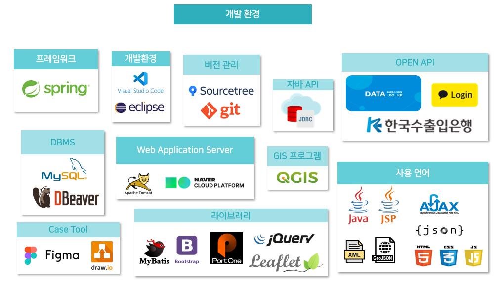
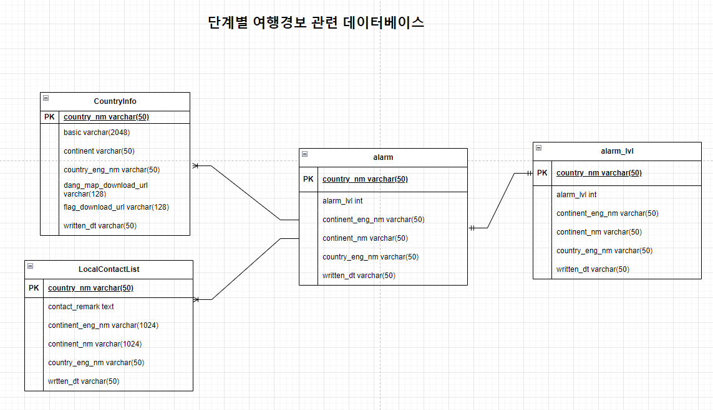
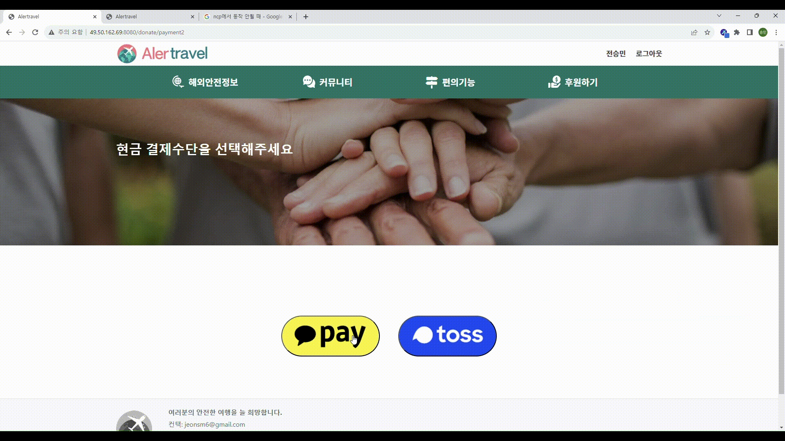

## 🌏 AlerTravel  ( 2023.10.25 ~ 2023.12.08 )

> 'AlerTravel'은 해외 여행 계획 수립 시, 보다 안전하고 원하는 정보를 쉽고 빠르게 얻기 위한 사이트입니다.

 

### 시연 영상
- [서비스 시연 영상](https://youtu.be/p30uL2dLlIs?si=ZBA_4gPUigX4Ul0X) 

 

---

## 역할 분담
- 팀명 : Da-win
> **전승민 (PL)** : 여행 경보 페이지 구현, 여행 경보 DB 설계, 회원 관리 기능 구현, 프로젝트 총괄, 디버깅, 발표([@HermitCrapOfLine](https://github.com/HermitCrapOfLine)) 
> **김재원** : 후원하기 페이지 구현, 후원관련 DB 설계, 결제 기능 구현([@rekjeawon88](https://github.com/rekjeawon88)) 
> **박예경** : 네비게이션 바 디자인, 디자인 자료 조사 
> **안남기** : 공지사항 페이지 구현, 공지사항 DB 설계, 환율 기능 구현, 발표자료 제작([@namgi00](https://github.com/namgi00)) 
> **장지호** : ERD 기획 및 관리 
> **하지현** : 메인 화면 지도 구현, 소통게시판 구현 및 DB 설계, 국가별 기본정보·현지연락처 화면 구현 및 DB 설계([@marchislike](https://github.com/marchislike)) 

  

  ---

## 목차

프로젝트 개요

[프로젝트 개요](#1) 
    [1. 주제 선정 동기](#1.1) 
    [2. 개발 환경 및 사용 기술](#1.2) 
    [3. 프로젝트 진행 일정](#1.3)

서비스 설계

[서비스 설계](#2) 
    [1. 설계 산출물](#2.1) 
    [2. 서비스 별 기능](#2.2)

---
---

## 프로젝트개요

## 1. 주제 선정 동기
💡 해외여행경보와 여행후기를 한눈에 볼 수 있는 사이트의 필요성

💡 여행후기로는 위험 지역을 포함하여 생생한 경험을 나누고 안전에 대한 경각심을 제고

### 프로젝트 선정 배경
> 해외 여행을 준비하는 여행각들이 많아지면서 여행을 준비하는 국가의 현재 안전 여부를 파악하기에 실제 여행객들의 방문 후기를 모아 제공되는 서비스가 부족하고, 무분별한 광고로 인해 현실적으로 정확하지 않아 용이하지 않습니다. 또한, 여행 국가의 실제 안전경보와 여행객들이 생각하고 있는 안전정보가 일치하지 않는 경우가 많아 여행객들에게 안전에 대한 경각심을 제고하기 위해 "AlerTravel"을 개발하기로 결정하였습니다.   AlerTravel은 전세계 국가의 경보단계를 알려주고, 실제 사용자들간의 소통할 수 있는 서비스를 제공합니다.

### 벤치 마킹 사이트의 한계점

여행경보에 대한 다양한 내용은 있지만 공공기관 사이트 특성상 민원접수를 제외하면 단방향 소통에 그침

## 2. 개발 환경 및 사용 기술

#### Front-end
  

#### Back-end
   

 
 

## 3. 프로젝트 진행 일정

### 📝 [팀 노션](https://www.notion.so/a74afdd37147457cbea7665aa78032c4?v=ab7196d807424347990406a26bf8d8b7)
### 🗄️ [api 명세 & Figma](https://www.notion.so/API-Figma-a5d5995e9be9485996d1baf017b65226)

---

## 서비스 설계

## 1. 설계 산출물
### E-R Diagram

## 2. 서비스별 기능

### ✔ 회원관리 서비스
#### 📍회원가입
대상 : 일반회원
아이디, 비밀번호, 비밀번호 확인, 이메일 입력
#### 📍회원정보 수정
대상 : 일반회원
마이페이지에서 비밀번호 수정 가능 -> 이메일, 회원유형 수정 불가
#### 📍마이페이지
대상 : 일반회원
기존에 입력했던 아이디, 이메일, 가입일, 수정일을 확인. 비밀번호 변경 기능
#### 📍로그인/로그아웃
대상 : 일반회원
기존에 가입했던 이메일과 비밀번호를 통해 로그인, 카카오 소셜 로그인

#### 로그인 페이지

### ✔ 지도 서비스
#### 📍단계별 여행경보
대상 : 사이트를 이용하는 모든 사용자
지도를 통해 각 나라면 단계별 여행경보를 확인
#### 📍상세보기 페이지
대상 : 사이트를 이용하는 모든 사용자
지도의 국가명 클릭시 국가별 정보(지도,기본정보,현지연락처)를 확인

#### 지도 구현 화면

### ✔ 단계별 여행경보 서비스
#### 📍단계별 여행경보
대상 : 사이트를 이용하는 모든 사용자
페이지에서 버튼을 통해 단계별 여행경보로 분류된 국가들을 확인
#### 📍상세보기 페이지
대상 : 사이트를 이용하는 모든 사용자
목록에 있는 국가명 클릭시 국가별 정보(지도,기본정보,현지연락처)를 확인

### 여행 경보 화면

### ✔ 후원 서비스
#### 📍후원하기 기능
대상 : 사이트를 이용하는 모든 사용자
카카오페이, 토스 등과 같은 결제 시스템을 통해 후원
#### 📍후원내역 확인
대상 : 사이트를 이용하는 모든 사용자
이름, 전화번호, 이메일을 입력하여 후원 내역을 확인

### 결제 화면

---
